# Isometric Regularization of Deep Generative Models for Functional Data
Additional experimental results for ICML2024 rebuttal #2803

## 1. 2D Circles 
>radius of circles r=linspace(0.1, 0.5, 20), MLP dimensions=(4, 128, 128, 128, 128, 1), isometric weight=1 for every epoch

- We utilized two sampling schemes for the probability density function p(x; F_z): 1. uniform sampling 2. near-surface sampling 

### Latent Space

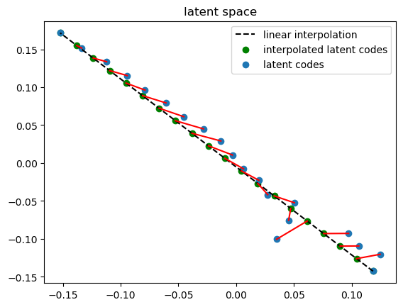
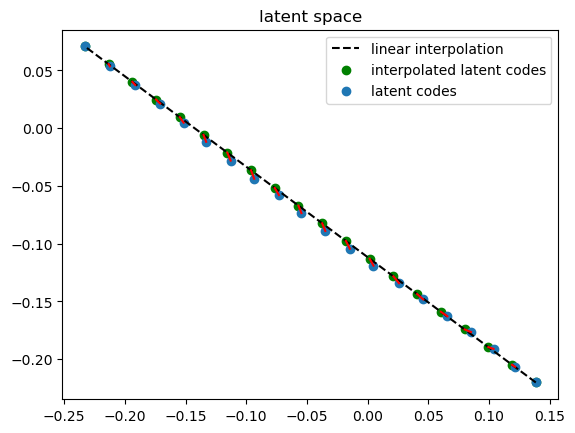 
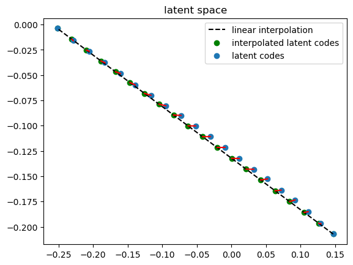 

  <I>Figure 1: <b>(Left)</b> Distorted Latent Space obtained by MLP, <b>(Middle)</b> Latent Space with small curvature obtained by IsoMLP with uniform sampling, and <b>(Right)</b> Latent Space obtained by IsoMLP with near-surface sampling. Blue points are optimized latent codes and green points are linearly interpolated codes between r=0.1 and r=0.5.</I>

 

### Interpolated Results

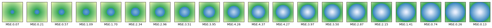
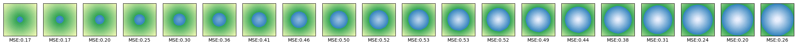 
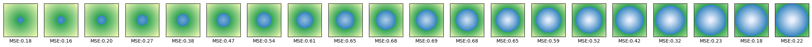 

  <I>Figure 2: <b>(Top)</b> Interpolated results obtained by MLP, <b>(Middle)</b> Interpolated results obtained by IsoMLP with uniform sampling, and <b>(Bottom)</b> Interpolated results obtained by IsoMLP with near-surface ampling. We computed MSE(multiplied by 1e4) between gt sdf and sdf samples from 128*128 grid. </I>

 
  
### Average Errors

- MSE(multiplied by 1e4) between SDF samples from interpolated latent codes and GT SDF.

| Model        | Average error           |
| ------------- |:-------------:|
| MLP | 2.2159 |
| IsoMLP (uniform)      | 0.3615      |
| IsoMLP (near-surface) | 0.4310      |

## 2. 3D Box, Cone, Cylinder
>Box: (l_x, l_y)=meshgrid(linspace(0.5, 1.2, 10),linspace(0.5, 1.2, 10)), l_z=1,
>Cone&Cylinder: r=linspace(0.8,0.4,100), h=1.2-r, 
>MLP dimensions=(5, 256, 256, 256, 1)

- We trained 300 shapes with 3D shapes (Box, Cone, Cylinder) in a 2-dimensional latent space.
- We utilized three sampling schemes for the probability density function p(x; F_z):
  1. uniform sampling
  2. hybrid sampling (half uniform sampling + half near_surface sampling)
  3. near-surface sampling 
- We utilized [Pointnet Encoder](https://github.com/qinglew/PCN-PyTorch) with randomly initialized network parameters and no training to initialize latent codes.
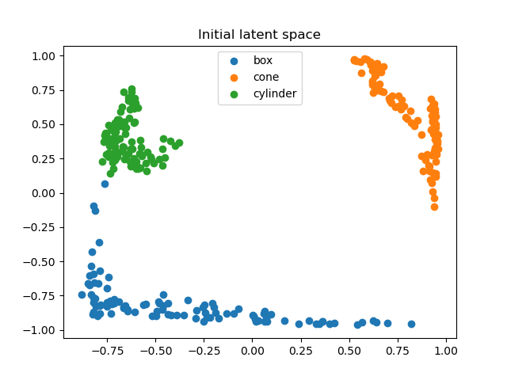

### Latent Space
#### Analysis on sampling scheme
  > isometric weight=10 for every epoch

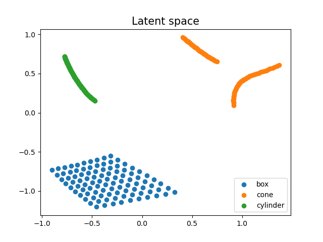
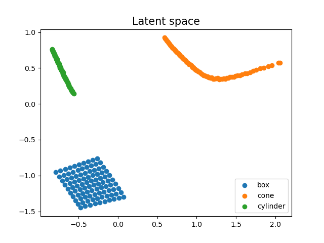 
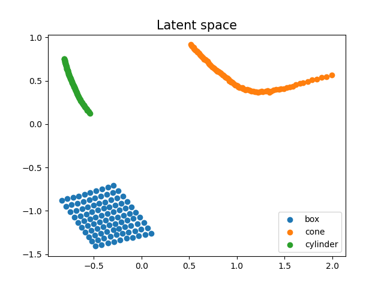 
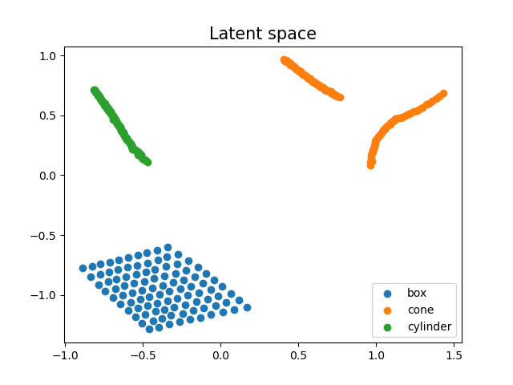 

  <I>Figure 3: Latent space obtained by <b>(First)</b> MLP, <b>(Second)</b> IsoMLP with uniform sampling, <b>(Third)</b> IsoMLP with hybrid sampling, and <b>(Last)</b> IsoMLP with near-surface sampling. Our method encourages the latent space to satisfy isometry, connecting the orange lines disconnected in MLP and changing the blue parallelogram closer to a square. Near-surface sampling fails since spatial points are sampled from different regions on different shapes, and they barely overlap.</I>

 

#### Analysis on isometric weight
  > hybrid sampling

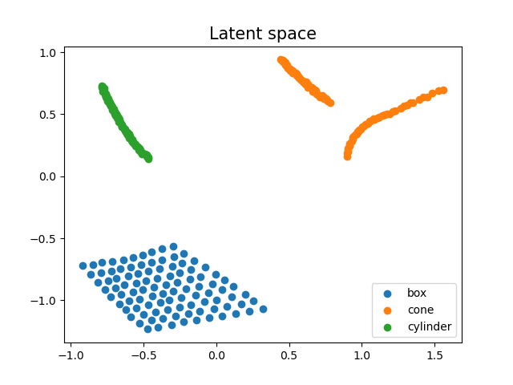 
 
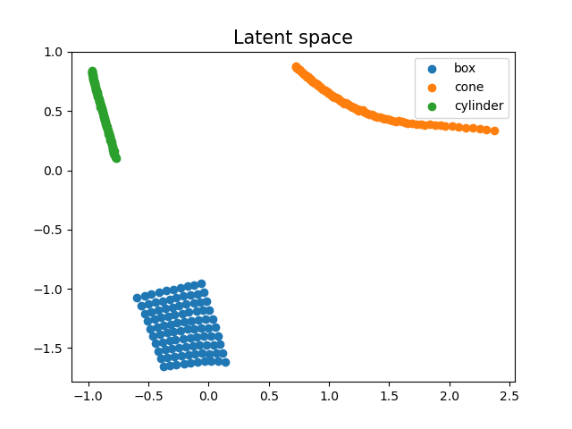 

  <I>Figure 4: Latent space obtained by <b>(First)</b> isometric weight=1, <b>(Second)</b> isometric weight=10, and <b>(Third)</b> isometric weight=100. </I>

 
